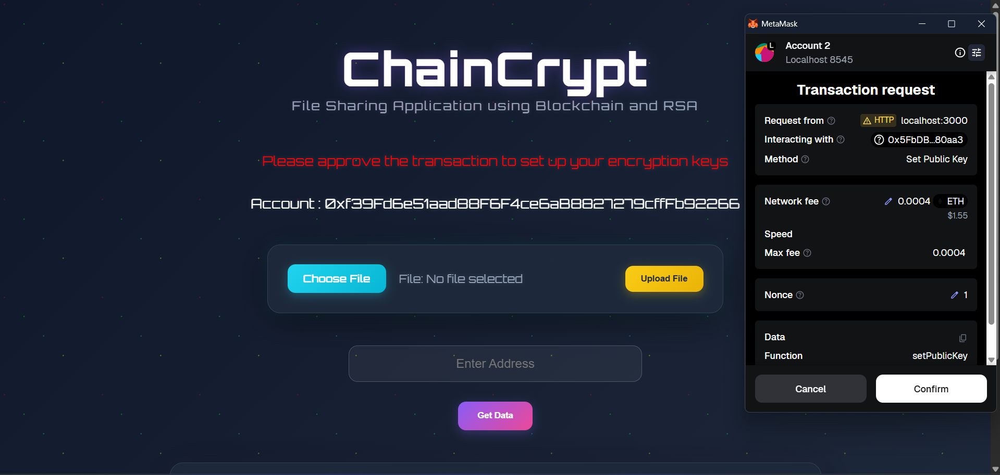
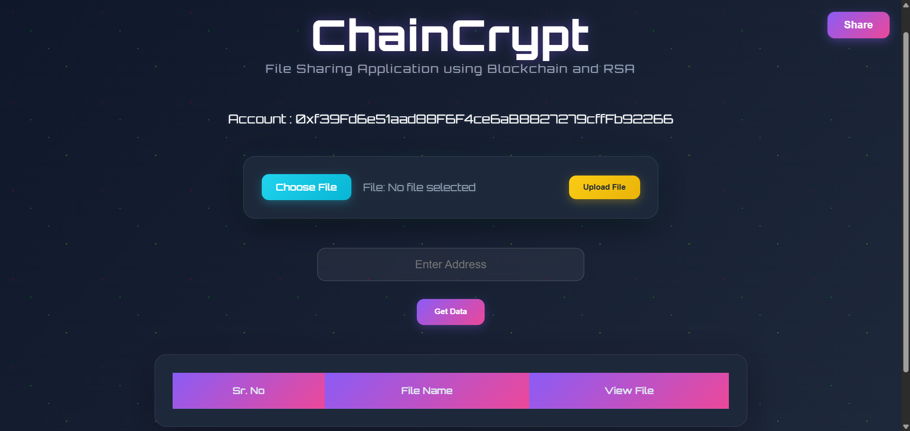
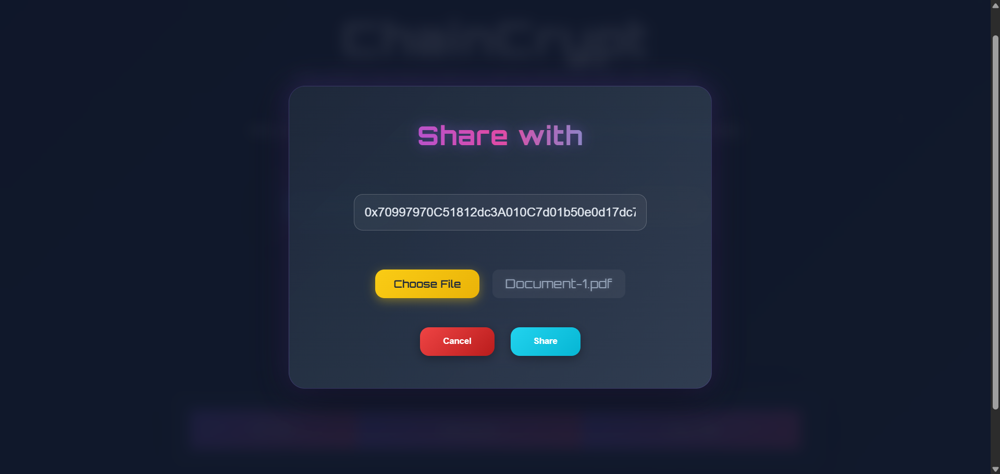
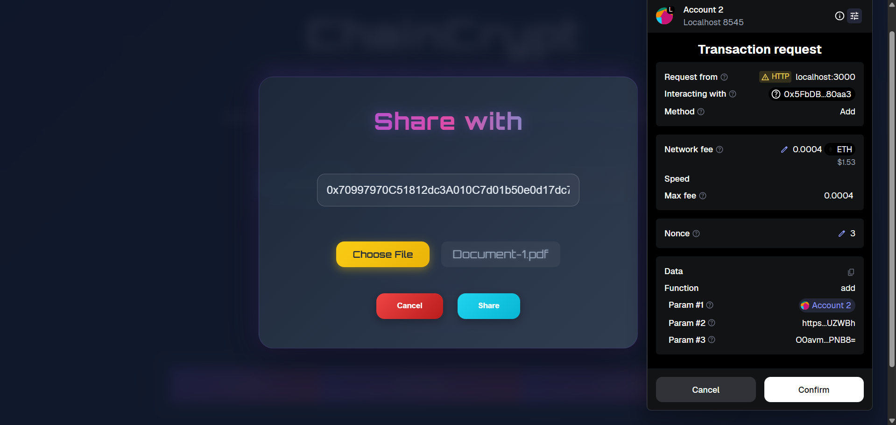
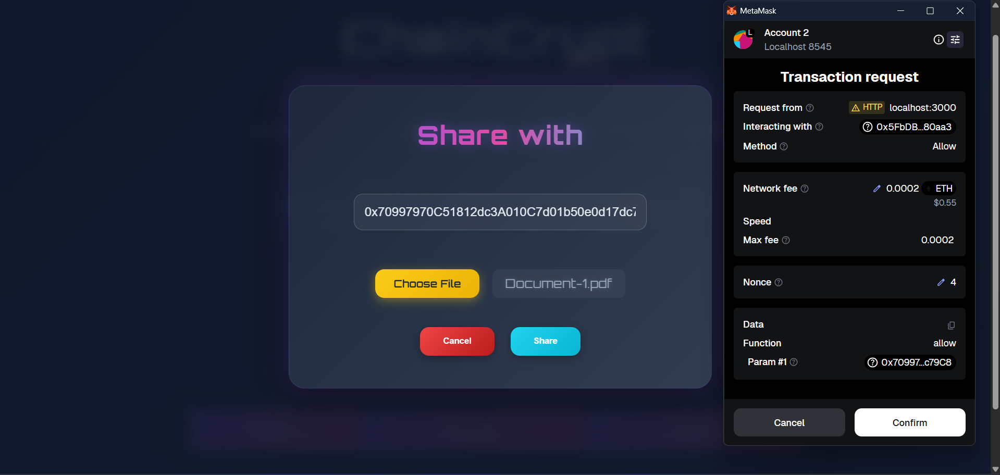
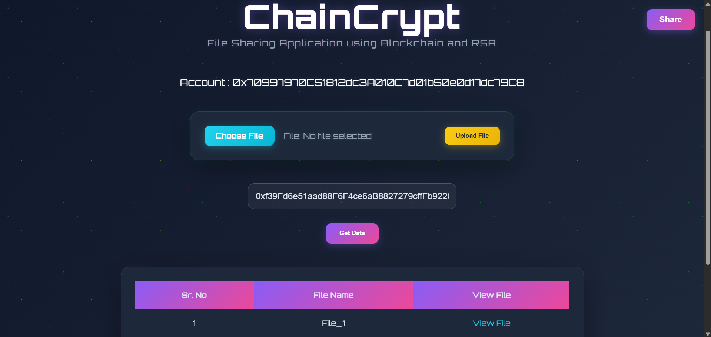

# 🔐 ChainCrypt: Secure File Sharing using Blockchain and RSA

_A decentralized, end-to-end encrypted platform for verifiable and tamper-proof file exchange._

<p align="center">
  
  
  
  
  
</p>

## 📖 Table of Contents

- [📝 Project Overview](#-project-overview)
- [✨ Key Features](#-key-features)
- [🏛️ System Architecture](#-system-architecture)
- [🛠️ Technologies Used](#-technologies-used)
- [🚀 Getting Started](#-getting-started)
- [📸 Screenshots](#-screenshots)

## 📝 Project Overview

### The Challenge

Traditional file-sharing relies on centralized servers, making systems prone to security breaches, unauthorized access, and censorship. This single point of failure compromises user privacy and data integrity.

### The Solution

ChainCrypt is a decentralized application that provides a robust solution by integrating blockchain technology with RSA encryption. This architecture ensures that file transfers are not only secure and private but also transparent and verifiable. By eliminating third-party intermediaries, ChainCrypt empowers users with complete control and ownership of their digital content.

## ✨ Key Features

- 🔒 **End-to-End RSA Encryption**: All files are encrypted client-side using the recipient's public key before being uploaded. This ensures that only the intended recipient, possessing the corresponding private key, can access the content.
- ☁️ **Decentralized Storage (IPFS)**: Encrypted files are stored on the Inter Planetary File System (IPFS) via Pinata. This distributed storage approach enhances data availability and resilience while maintaining content addressability.
- ✅ **Blockchain-Based Access Control**: File metadata, including the sender and recipient wallet addresses and the IPFS Content Identifier (CID), is logged on an Ethereum smart contract. This immutable record provides a verifiable and tamper-proof audit trail for all transactions.
- 🌐 **Decentralized Authentication**: Users authenticate seamlessly using their MetaMask wallet, providing a secure and trustless alternative to traditional login systems.

## 🏛️ System Architecture

ChainCrypt's architecture is a multi-layered design built for security and decentralization:

1. **Initial Setup**: Upon a user's first visit, the client-side application triggers a transaction via MetaMask to register the user's public key on the blockchain. This is the foundational step for all subsequent encryption and access control.
2. **Client-Side Operations**: The user interface, built with React.js, handles all sensitive operations directly in the browser. This includes RSA key pair generation and file encryption. The client also uses axios to manage API calls to the Pinata service.
3. **Smart Contract Interaction**: The frontend communicates with a Solidity smart contract deployed on an Ethereum network using Web3.js. This contract stores the immutable metadata (CID, sender, recipient) for every shared file.
4. **IPFS Integration**: The encrypted file is uploaded to IPFS through the Pinata service. IPFS returns a unique CID, which is then stored on the blockchain, creating a permanent link to the encrypted data.
5. **File Retrieval**: A recipient uses their MetaMask wallet to query the smart contract for CIDs associated with their address. The encrypted file is then fetched from IPFS using the CID and decrypted locally using the user's private key.

## 🛠️ Technologies Used

- **Frontend**: React.js | CSS | axios
- **Smart Contracts**: Solidity | Hardhat | Web3.js
- **APIs**: Pinata API
- **Security**: JSEncrypt (for RSA Encryption)
- **Storage**: IPFS

## 🚀 Getting Started

Follow these steps to set up and run the project locally.

### Prerequisites

- Node.js and npm installed.
- MetaMask browser extension.
- A Pinata API Key and Secret.

### Key Project Setup Details

- **Contract Address**: Every time you run `npx hardhat node`, it starts a fresh local blockchain. When you run the `deploy.js` script, it deploys your smart contract to this new network instance at a brand-new address. Your `client/src/App.js` file needs to be updated with this new address to interact with the contract.
- **Pinata API Keys**: The Pinata keys are your credentials for uploading files to the decentralized IPFS network. Your project needs to use these keys in the `client/src/components/FileUpload.js` and `client/src/components/Modal.js` components to successfully make the API calls to Pinata.

1. **Clone and Install Dependencies**

```
git clone https://github.com/your-username/ChainCrypt.git
cd ChainCrypt
npm install
npm install jsencrypt
```

2. **Smart Contract Setup**

```
npm install --save-dev hardhat
npx hardhat compile
```

3. **Run Hardhat Local Network**
   Open a new terminal to start the local Ethereum network:

```
npx hardhat node
```

This will provide local accounts and private keys to import into MetaMask.

4. **Configure MetaMask**
   Add a custom network in MetaMask to connect to your local Hardhat node:

- Network Name: HardHat
- New RPC URL: http://127.0.0.1:8545
- Chain ID: 1337
- Currency Symbol: ETH

5. **Deploy Smart Contracts**
   Deploy the contracts to your local network in another terminal:

```
npx hardhat run scripts/deploy.js --network localhost
```

Note: Every time the Hardhat network is restarted, you must redeploy the contracts. After deployment, update the contract address in `client/src/App.js` with the new address that is logged in the terminal after the deployment.

6. **Configure Pinata API Keys**
   Before running the frontend, you must add your Pinata API Key and Pinata Secret API Key to the following files:

- `client/src/components/FileUpload.js`
- `client/src/components/Modal.js`

7. **Run the Frontend**
   Navigate to the client directory and start the application:

```
cd client
npm install
npm start
```

The application will be running at http://localhost:3000.

## 📸 Screenshots

To help new users understand the application's flow, the following screenshots are included:

- 🔐 **Key Setup Transaction**: The Metamask popup asking for approval to set a user's public key on the blockchain.  
  

- 🏡 **Main Application Dashboard**: The main UI of the application, showing a clean interface for file sharing.  
  

- 📤 **Sharing a File with Recipient's Address**: The modal or page where a user selects a file and inputs the recipient's wallet address.  
  

- 📄 **File Ready for Sharing**: The UI showing the selected file's name and details, just before the share action is initiated.  
  

- ⏳ **Sharing Transaction via Metamask**: The Metamask popup asking for approval of the sharing transaction, demonstrating the on-chain event.  
  

- 🔎 **Receiver's View After "Get Data"**: The receiver's screen after entering the sender's address, with the file now visible and ready to view.  
  
